# How CROA Stops AI Agent Trespass: Architecture and Developer Checklist

```mermaid
flowchart LR
    classDef agent fill:#dbeafe,stroke:#1d4ed8,stroke-width:2px,color:#0f172a
    classDef croa fill:#ede9fe,stroke:#6d28d9,stroke-width:2px,color:#0f172a
    classDef execution fill:#dcfce7,stroke:#15803d,stroke-width:2px,color:#0f172a
    classDef evidence fill:#f1f5f9,stroke:#64748b,stroke-width:2px,color:#0f172a
    classDef deny fill:#fee2e2,stroke:#b91c1c,stroke-width:2px,color:#7f1d1d

    subgraph Sandbox ["⑧ Isolation boundary: you must enforce it"]
        direction LR
        agent["AI agent"]:::agent
        tools["① Tool layer<br/>Proposes actions;<br/>never executes directly"]:::agent
    end

    subgraph Plane ["Control plane: should this action happen?"]
        direction LR
        c3["② C3 Path Resolver<br/>Approved target?<br/>stops Gemini #1"]:::croa
        c2["③ C2 Governor + C1 Policy<br/>Allowed here, this way?<br/>stops Gemini #3"]:::croa
        c4["④ C4 Invariant Monitor<br/>Too many attempts? max 3<br/>stops Gemini #2"]:::croa
        c7["⑤ C7 Contract Compiler<br/>Signs a one-time slip"]:::croa
    end

    c6["⑥ C6 Execution Firewall<br/>Checks the slip,<br/>injects the secret"]:::execution
    world["Real systems"]:::execution
    deny["DENY + reason code<br/>Nothing executes"]:::deny
    c5["⑦ C5 Evidence Log<br/>Hash-chained record"]:::evidence

    agent --> tools --> c3 --> c2 --> c4 --> c7
    c7 -->|"slip returned;<br/>tool presents it"| c6 --> world
    Plane -.->|"any check fails"| deny
    c6 -.->|"bad slip"| deny
    Plane -.->|"every decision"| c5
    c6 -.->|"every outcome"| c5

    style Sandbox fill:none,stroke:#1d4ed8,stroke-width:2px,stroke-dasharray: 6 4
    style Plane fill:none,stroke:#6d28d9,stroke-width:1px,stroke-dasharray: 4 4
```

## Developer steps

1. **Route every external action through tools.** The agent proposes; it never executes directly ([`agent/tools.py`](../agent/tools.py), [`runtime.py`](../runtime.py)).
2. **Register approved targets.** Anything unregistered or ambiguous is denied ([`croa/c3_resolver.py`](../croa/c3_resolver.py)).
3. **Write policy rules and issue credentials by reference.** Define which actions are allowed, where, and how to authenticate; the agent never sees real secrets ([`croa/c1_policy.py`](../croa/c1_policy.py), [`croa/c2_governor.py`](../croa/c2_governor.py)).
4. **Set sequence limits.** Check and commit trajectory counts atomically, such as 3 login attempts per session, agent, and target ([`croa/c4_trajectory.py`](../croa/c4_trajectory.py)).
5. **Sign a short-lived, single-use contract.** Bind the cryptographic permission slip (ECC) to the exact action and parameters ([`croa/c7_compiler.py`](../croa/c7_compiler.py)).
6. **Put an execution firewall in front of real systems.** Verify the signature, identity, expiry, parameters, and one-time use, recheck policy, then inject secrets and execute ([`croa/c6_firewall.py`](../croa/c6_firewall.py)).
7. **Record every decision and outcome in a hash-chained log.** Append audit records with predecessor hashes so edits, deletions from the middle, and reordering are detected (see Limits) ([`croa/c5_evidence.py`](../croa/c5_evidence.py)).
8. **Isolate the agent so its only route to real systems is the firewall.** In production, this boundary must be enforced by process or network isolation ([`runtime.py`](../runtime.py) composition root).

## Limits

- **Agent isolation is developer-enforced:** CROA assumes the agent cannot access protected systems directly; in production, developers must enforce process- or network-level isolation (in this demo, isolation is a code convention verified by test boundaries).
- **CROA governs execution actions, not research:** Read-only exploration, such as company-name lookup or reading public code repositories, is outside CROA checkpoints; CROA only intervenes when an agent attempts execution actions (like logins or file access).
- **Cryptographic alteration detection vs. end truncation:** Permission slips are signed so any modification is detected (not "tamper-proof"), and the evidence log detects middle deletions, reordering, and data edits, but cannot detect records removed from the end unless its final hash is anchored externally.
